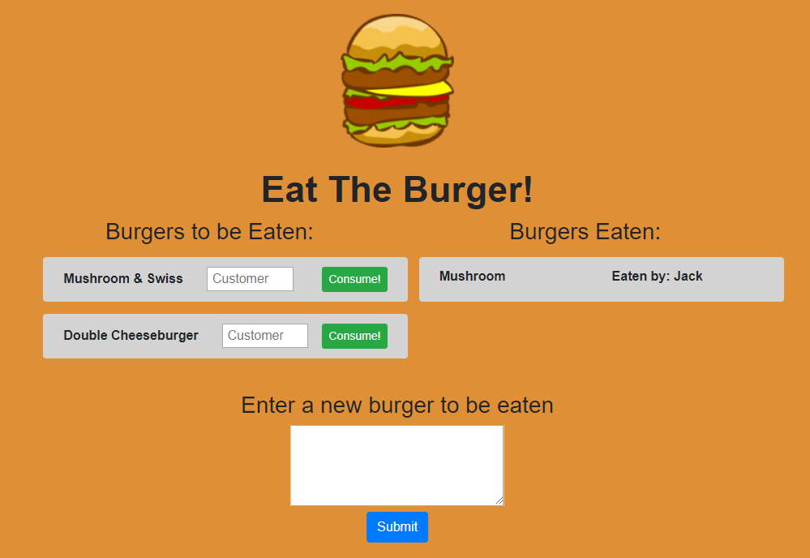
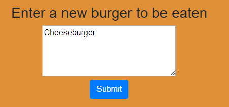
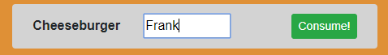
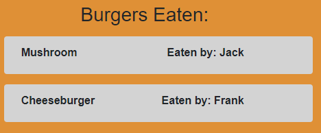

# Eat-Burger
 
Title: Eat the Burger - Sequelized! 
Developer: Kevin Flerlage 
Deployment Date: 12/14/2018 
For: Northwestern Coding Bootcamp 

## **Description**

Eat the Burger is a web app which explores routing using Node, Express and Handlebars. This single page web app allows users to add new burgers to be eaten through a text box as well as eat burgers which were previously added to the list. 

The objective of this app was to update the previous Eat The Burger assignment with Sequelize. This involved changing the routing, connections and removing the handmade ORM. Being complete, the webpage is dynamically provided with Handlebars with the burgers provided being pulled from the Sequelize database and sorted into the columns within Handlebars. 

## **Demo**

 

The web page starts with two columns, one for burgers which are ready to be eaten, and burgers which have previously been eaten. From here the user can enter their name and press the "Consume!" button to "eat" the burger. This moves it over to the other column. Additionally they can make a new burger using the textbox and "Submit" button. 

 

To add a new burger into the database the user must input a name for the burger and press "Submit". There is no validation on the burger's name, except it cannot be blank. After submitting the burgers table in the database will be updated the burger will be shown on the To Be Eaten column. 

 

The new burger is automatically assigned an ID which is then added to the data field of the button. To "eat" the burger and move it over to the other field the user must enter a name and press the "Consume!" button. As above, there is no validation on the name except that the field cannot be empty. Pressing this button will update the Customer table with the name inputted as well as update the burger's record in the burger table. 

 

 

From here the user can add more burgers or eat any of the burgers on the list.

## **Reflection**

This assignment was an interesting exercise in moving from one database to the other. The focus of this assignment was to show how sequelize makes the database management simplier. While it was easier to create than the previous homework assignment, there are a few improvements which I would enjoy to put in. I couldn't quite figure out how to populate the customer name off the customer table after relating a burger to a customer. Additionally, a future update should have a customer that can have multiple burgers, where currently each burger eaten creates a new customer.