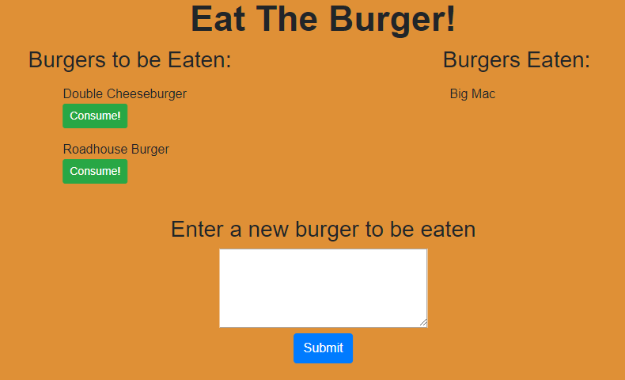
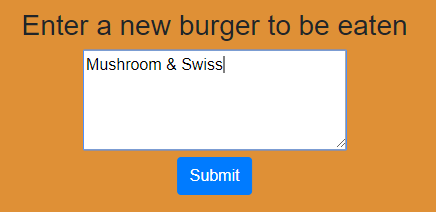
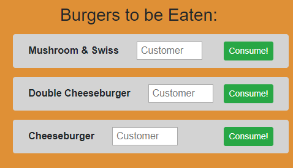
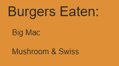

# Eat-Burger
 
Title: Eat the Burger! 
Developer: Kevin Flerlage 
Deployment Date: 12/09/2018 
For: Northwestern Coding Bootcamp 

## **Description**

Eat the Burger is a web app which explores routing using Node, Express and Handlebars. This single page web app allows users to add new burgers to be eaten through a text box as well as eat burgers which were previously added to the list. 

The objective of this app was to facilitate routing through express while also modifying a mySQL database. The database management was done through using an ORM. The webpage is dynamically provided with Handlebars with the burgers provided being pulled from the mySQL database and sorted into the columns within Handlebars. 

## **Demo**

 

The web page starts with two burgers provided for the user to consume and one which has already been eaten. From here the user can press the "Consume!" button to "eat" the burger and move it over to the other column, or they can make a new burger using the textbox and "Submit" button. 

 

The user needs to enter the name in the text box and press the "Submit" button for the new burger to be added to the "Burgers to be Eaten" column. Once the user presses "Submit" the page then reloads to show the change to the database. 

 

The new burger is automatically assigned an ID which is then used to track if the user consumes the burger. From here the user can choose to add another burger using the same process or consume any of the burgers that are on the list. 

 

From here the user can add more burgers or eat any of the burgers on the list.

## **Reflection**

The most difficult part of this assignment was conceptualizing the process which information should flow. As this is my first real experience with routing, express, handlebars and an ORM this assignment was challenging, particularly at the start. Going forward this app can be improved by making this into a more general list app, such as a shopping list or something of that matter. In doing that, there should be a button which updates the list items to change to different wording. Additionally, there could be a counter with each item in case there is more than one of each item.